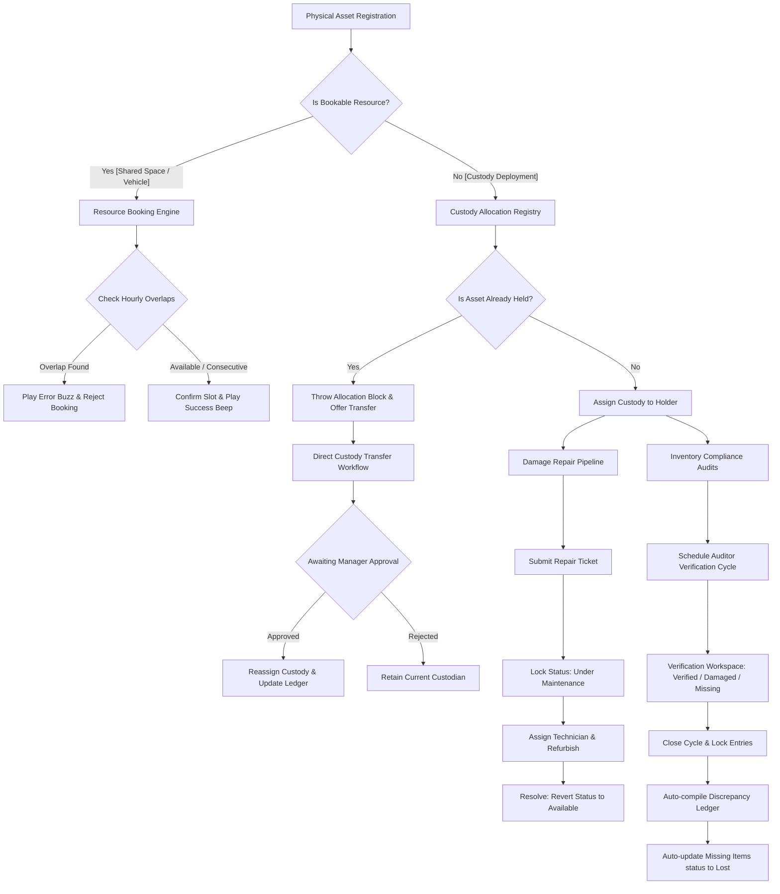

# AssetFlow - Premium Enterprise Asset & Resource ERP

AssetFlow is a luxurious, fully-featured, and secure **Enterprise Asset & Resource Management ERP Platform**. Built with a state-of-the-art gold-on-charcoal glassmorphic design, it digitizes physical asset lifecycles, shared resource scheduling, maintenance pipelines, and compliance inventory audits.

---

## 🗺️ System Workflow Flowchart

The diagram below details the operational states and validation guardrails built into the AssetFlow engine:



---

## 🏛️ Architecture & Core Components

AssetFlow is designed with a **Separation of Concerns (SoC)** architecture consisting of three main layers:

```
┌────────────────────────────────────────────────────────┐
│                      FRONTEND SPA                      │
│   (HTML5 / CSS3 Grid & Flexbox / Vanilla JS Module)    │
│  - Gold-Glassmorphism Premium CSS Theme                │
│  - Browser Sound Synthesizer (Web Audio API)           │
│  - Simulated QR Tag Scanner with moving laser scan     │
│  - Interactive Timeline Date Picker                    │
│  - Live Toast Alert Notification Layer                │
│  - Interactive Utilization Charting (Chart.js)         │
└──────────────────────────┬─────────────────────────────┘
                           │ HTTPS API Calls (REST)
                           ▼
┌────────────────────────────────────────────────────────┐
│                    FASTAPI BACKEND                     │
│               (Python REST Routing Engine)             │
│  - RBAC (Role-Based Access Control) Validation         │
│  - Reservation Conflict & Overlap Check Engine         │
│  - Audit Cycle discrepancy compile automation         │
│  - Direct PDF/CSV Ledger Export Services               │
└──────────────────────────┬─────────────────────────────┘
                           │ JSON Reads & Writes
                           ▼
┌────────────────────────────────────────────────────────┐
│                   PERSISTENT STORAGE                   │
│                     (JSON Database)                    │
│  - Departments, Categories, and Employee Directory     │
│  - Asset Registry, Allocations, and Timeline Bookings   │
│  - Repair Tickets, Audit Runs, and Security Trail      │
└────────────────────────────────────────────────────────┘
```

### 1. The Gold-Glassmorphic Frontend SPA
- **Aesthetic**: Radial gradients rendering golden-bronze ambient flows across a deep charcoal backdrop, utilizing Outfit and Space Grotesk typography.
- **Physical Feedback Synthesizer**: Utilizes the browser's native **Web Audio API** to compile and play double-pitched victory beeps for success states, low-pitched buzzes for errors/validation blocks, and target sonar beeps for code scanning.
- **Simulated QR Scanner**: A sliding green scanning laser viewport directly retrieves asset registry entries.
- **Interactive Timeline Calendar**: Allows selecting any schedule date to filter and review hourly reservations (09:00 - 18:00) for company cars or boardrooms.
- **Rbac Tester Sandbox**: Switch clearance levels (Admin, Manager, Head, Employee) dynamically in the header to evaluate permissions constraints.

### 2. The Python FastAPI Server
- Enforces double-allocation constraints: blocks attempts to deploy an asset currently held by another custodian and offers to route a transfer instead.
- Enforces hourly bookings validation: allows consecutive reservations (e.g. 10:00–11:00 starts when 09:00–10:00 ends) but blocks overlapping slots.
- Controls audit workflows: closing an audit cycle locks verified entries, compiles discrepancy reports, and automatically sets missing physical assets to `Lost` in the directory.

### 3. Persistent JSON Storage Database
- Maintains strict relation keys between users, allocations, categories, and maintenance.
- Features a security audit trail recording operational timestamps, operator names, Rbac clearance levels, and details for every admin action.

---

## 🚀 Getting Started

### 1. Installation
Clone the repository and install the dependencies:
```bash
pip3 install fastapi uvicorn
```

### 2. Run the ERP Server
Start the Uvicorn server locally:
```bash
python3 server.py
```
The server will run on **`http://127.0.0.1:8080`**. Open this URL in your web browser.
*Note: The login credentials on the authentication overlay are prefilled for instant review (`admin@assetflow.com` / `password123`).*

### 3. Run Automated Logic Tests
We have built an automated backend test suite to validate database constraints:
```bash
python3 /Users/mamatabalakatte/.gemini/antigravity/brain/e36a8e73-aef4-4cd5-aa5b-676bd0ad3b95/scratch/verify_logic.py
```
This validates roles boundary creation, double allocation blocks, calendar overlaps, maintenance transitions, and audit closures.
